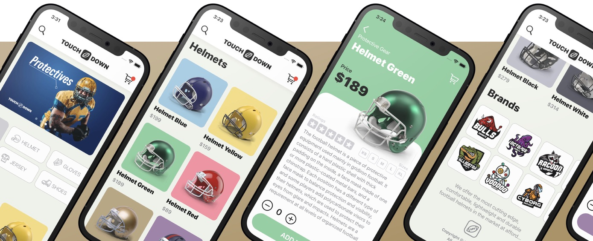

# Touchdown-SwiftUI
E-commerce app built in SwiftUI. Built in the course SwiftUI Masterclass in Udemy.

Main components and concepts used:
* @EnvironmentObject property wrapper
* @ObservableObject property wrapper
* Custom navigation bar
* Custom shape with Path
* PageTab View
* GridLayouts
* JSON decoding
* Adaptative layout design

